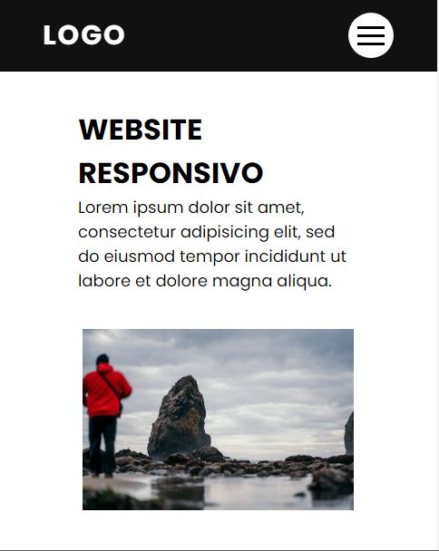

  # Website Responsivo Single Page
  
  
  * Link: https://renatomartinsxrd.github.io/Website-Responsivo-Single-Page.github.io/
  
  
  > Website responsivo
  
  > Navegação em uma página
  
  > Ux Design
  
  
  
  
  
  
  
  
  
  # Ferramentas utilizadas
  
  * HTML
  * CSS3 utilizando flexbox e media queries
  * Javascript

  
  
 

